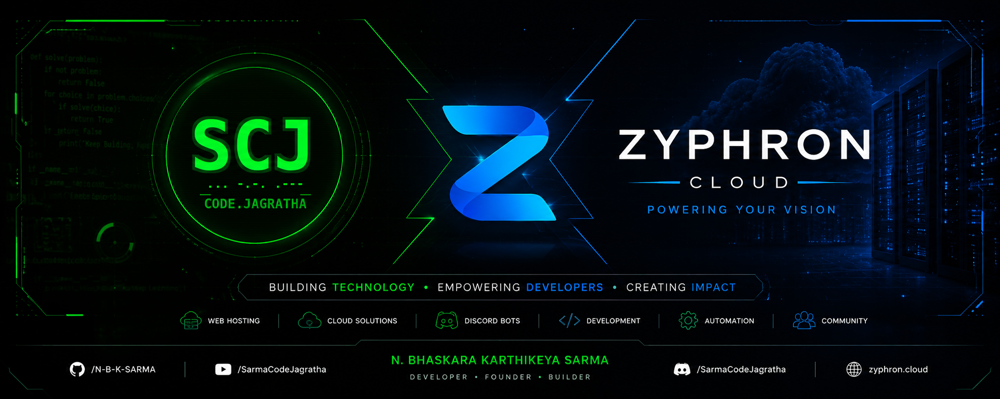

<div align="center">
  <a href="https://github.com/N-B-K-SARMA">
    
  </a>
  
  <br><br>

  <h3 align="center" style="color: #0070F3;">
    Co-Founder @ Zyphron • Founder @ Sarma Code Jagratha • Backend Developer<br>
    Cloud Infrastructure • Discord Bot Developer • Cyber Security Student • Open Source Enthusiast
  </h3>
</div>

<br>

<div align="center">
  <p>Building scalable backend architectures, cloud infrastructure, and modern SaaS platforms.<br>Currently developing <b>Zyphron</b>, educating developers at <b>Sarma Code Jagratha</b>, and engineering <b>ClashOps</b> & <b>Universe RP</b>.</p>
</div>

<br>

---

## 🏢 Organizations

<div align="center">
  <table>
    <tr>
      <td align="center" width="50%">
        <h3>☁️ Zyphron</h3>
        <p><i>Premium Cloud & SaaS Solutions</i></p>
        <a href="https://github.com/N-B-K-SARMA">
          
        </a>
        <p>Modern infrastructure, sleek glassmorphism design, and robust backend engineering for the next generation of scalable applications.</p>
      </td>
      <td align="center" width="50%">
        <h3>🟢 Sarma Code Jagratha (SCJ)</h3>
        <p><i>Empowering Developer Communities</i></p>
        <a href="https://github.com/N-B-K-SARMA">
          
        </a>
        <p>Cyber education, programming resources, and community-driven open source initiatives with a high-tech edge.</p>
      </td>
    </tr>
  </table>
</div>

<br>

## 🚀 Featured Projects

<div align="center">
  <table>
    <tr>
      <td align="center" width="50%">
        <h3>⚔️ ClashOps</h3>
        <p>A comprehensive operations and management tool.</p>
        <a href="https://github.com/N-B-K-SARMA">
          
        </a>
      </td>
      <td align="center" width="50%">
        <h3>🌌 Universe RP</h3>
        <p>Advanced roleplay framework and systems.</p>
        <a href="https://github.com/N-B-K-SARMA">
          
        </a>
      </td>
    </tr>
    <tr>
      <td align="center" width="50%">
        <h3>☁️ Zyphron</h3>
        <p>Premium cloud infrastructure and SaaS solutions.</p>
        <a href="https://github.com/N-B-K-SARMA">
          
        </a>
      </td>
      <td align="center" width="50%">
        <h3>🟢 Sarma Code Jagratha</h3>
        <p>Empowering developer communities.</p>
        <a href="https://github.com/N-B-K-SARMA">
          
        </a>
      </td>
    </tr>
  </table>
</div>

<br>

## ⚙️ Tech Stack

<div align="center">
  <a href="https://github.com/N-B-K-SARMA"></a>
  <br><br>
  <a href="https://github.com/N-B-K-SARMA"></a>
  <br><br>
  <a href="https://github.com/N-B-K-SARMA"></a>
  <br><br>
  <a href="https://github.com/N-B-K-SARMA"></a>
</div>

<br>

## 📊 GitHub Analytics

<div align="center">
  <a href="https://github.com/N-B-K-SARMA">
    
  </a>
  <a href="https://github.com/N-B-K-SARMA">
    
  </a>
  <br><br>
  <a href="https://github.com/N-B-K-SARMA">
    
  </a>
</div>

<br>

<div align="center">
  <a href="https://github.com/ryo-ma/github-profile-trophy">
    
  </a>
</div>

<br>

## 🐍 Contribution Graph

<div align="center">
  <a href="https://github.com/N-B-K-SARMA">
    <picture>
      <source media="(prefers-color-scheme: dark)" srcset="https://raw.githubusercontent.com/N-B-K-SARMA/N-B-K-SARMA/output/github-contribution-grid-snake-dark.svg">
      <source media="(prefers-color-scheme: light)" srcset="https://raw.githubusercontent.com/N-B-K-SARMA/N-B-K-SARMA/output/github-contribution-grid-snake.svg">
      
    </picture>
  </a>
  <br><br>
  <a href="https://github.com/N-B-K-SARMA">
    
  </a>
</div>

<br>

## 📈 Development Metrics

<!--START_SECTION:waka-->

```txt
From: 02 July 2026 - To: 02 July 2026

Total Time: 0 secs

No activity tracked
```

<!--END_SECTION:waka-->

<br>

## ⚡ Latest GitHub Activity

<!--START_SECTION:activity-->
<!--END_SECTION:activity-->

<br>

## 🎯 Current Focus

<div align="center">
  <table>
    <tr>
      <td>🏗️ Building <b>Zyphron</b></td>
      <td>🌱 Growing <b>Sarma Code Jagratha</b></td>
    </tr>
    <tr>
      <td>⚔️ Developing <b>ClashOps</b></td>
      <td>🌌 Building <b>Universe RP</b></td>
    </tr>
    <tr>
      <td>☁️ Learning <b>Cloud Infrastructure</b></td>
      <td>🚀 Learning <b>DevOps</b></td>
    </tr>
  </table>
</div>

<br>

## 📫 Connect with Me

<div align="center">
  <a href="https://github.com/N-B-K-SARMA"></a>
  <a href="#"></a>
  <a href="#"></a>
  <a href="#"></a>
  <a href="#"></a>
</div>

<br>

<div align="center">
  <a href="https://github.com/N-B-K-SARMA">
    
  </a>
</div>
